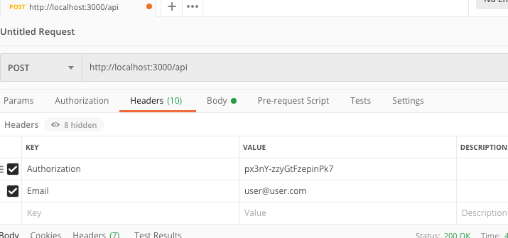
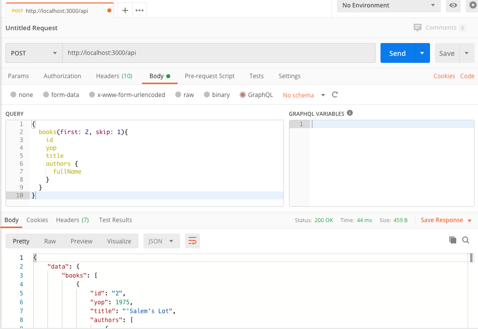

# README

## To install and run just:

* Ruby version
  `ruby-2.6.5`

* Configuration
  `bundle install`

* Database creation
  `bundle exec rails db:setup`

* To run all tests
  `bundle exec rspec`

## To locally test follow these steps:

* To check the GraphQL Schema just run the server
  `bundle exec rails s` and go to http://localhost:3000/graphiql

* To sign in, create a new query:
```graphql
mutation {
  signIn(
    email: "admin@admin.com",
    password: "test1234"
  ){
    firstName
    lastName
    email
    authenticationToken
  }
}
```

and you'll get something like:
```graphql
{
  "data": {
    "signIn": {
      "firstName": "Admin",
      "lastName": "Admin",
      "email": "user@user.com",
      "authenticationToken": "px3nY-zzyGtFzepinPk7"
    }
  }
}
```

But you'll need to pass headers to some endpoints and currently [GraphiQL for Rails](https://github.com/rmosolgo/graphiql-rails/) is not compatible with them, so I encourage you to use the [Electron GraphiQL App](https://www.electronjs.org/apps/graphiql) or you always can use [Postman](https://www.postman.com/).

The `authenticationToken` field is the header you'll need to pass along with the email in a POST` request to http://localhost:3000/api:

```
Authorization: px3nY-zzyGtFzepinPk7
Email: user@user.com
```
Adding headers in the GraphiQL App is very easy, it's just clicking in the button *Edit HTTP Headers* and that would be it, so, I´ll cover the Postman configuration.

* To add HTP headers in Postman just create a new request and add the two headers described above:



* To set the GraphQL query just select *Body* and then *GraphQL* and write the query you want to perform:


#### ...and That's all folks!

If you have any question, please, don't hesitate to ask to bjohnmer@gmail.com

Thanks a lot!
